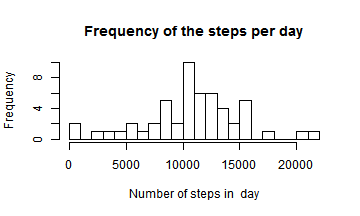
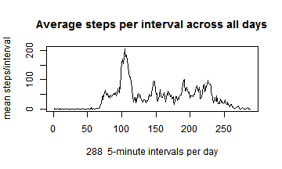
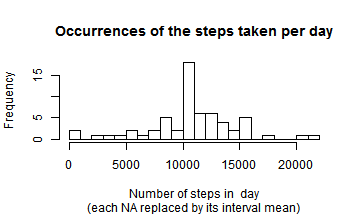
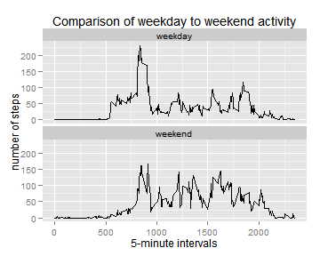

Note: knitr and ggplot2 warn about being built using R-3.1.2.  
I started using R-3.1.2 with R-studio and got errors so reverted to 3.1.1.

## Loading and preprocessing the data
  
Get and unpack the .csv file and check size 

```r
zipfile <- "./activity.zip"
csvfile <- unzip(zipfile, list=FALSE)
dataframe <- read.csv(csvfile, header=TRUE) 
d <- dim(dataframe) 
```
The data has  17568  observations and 3 variables

## What is mean total number of steps taken per day?


Method: Sum the steps for each day separately and then take the mean of these sums and the median of the sums


```r
daysums <- aggregate(dataframe$steps,  by = list(dataframe$date),  sum)
names(daysums) <- c("date", "steps")
daymean1 <- mean(daysums$steps, na.rm=TRUE)
daymedian1 <- median(daysums$steps, na.rm=TRUE)
paste("The day step counts have mean = ", round(daymean1, 2),
        " and median = ", round(daymedian1, 2))
```

[1] "The day step counts have mean =  10766.19  and median =  10765"
  
Histogram of the frequencies of daily steps,
ie how many times each step count occured

```r
hist(daysums$steps, 20, main="Frequency of the steps per day", 
     xlab="Number of steps in  day")
```

 

## What is the average daily activity pattern?

Method: Group the observations by each 5-minute interval and find the mean of each group

```r
intmeans <- aggregate(dataframe$steps,  by = list(dataframe$interval),
                      FUN=function(x) mean(x, na.rm=TRUE))
names(intmeans) <- c("interval", "steps")
```
  
Find the 5-minute interval containing the maximum mean

```r
rowindex <- which(intmeans$steps == max(intmeans$steps))
maxmeans <- intmeans[rowindex,]
```
Row 104 represents 5-minute interval  835 which contains the maximum mean = 206.17  
`  
Time Series plot of the means of 5-minute interval steps on average across all the days,


```r
plot(intmeans$steps, type="l",  
     main="Average steps per interval across all days",
     xlab=paste(nrow(intmeans)," 5-minute intervals per day"),
     ylab="mean steps/interval")
```

 


## Imputing missing values

There are 2304 occurrences containing steps = NA  
  
Method: Replace the NA steps by the means from the corresponding intervals

```r
# get means for intervals, (including NAs)
im <- aggregate(dataframe$steps,  by = list(dataframe$interval), 
                FUN=function(x) mean(x, na.rm=TRUE))
names(im) <- c("interval", "steps")

# Copy the dataframe and find the rows with NA
df <- dataframe
change <- which(is.na(df$steps))       # gets indices of NA rows

# for each NA row find the corresponding steps mean for its interval
#    # brute force method!
for (ic in change){                    # intervals with NA         
  # get the matching interval and store the mean    
  findim <- which(df$interval[ic] == im$interval)
  df$steps[ic] <- im$steps[findim]
}
```
There are now 0 NA rows.  

Get the mean and median of the total steps for each day

```r
daysums <- aggregate(df$steps,  by = list(df$date),  sum)
daymean2 <- mean(daysums$x, na.rm=TRUE)
daymedian2 <- median(daysums$x, na.rm=TRUE)
paste("The total steps for the days have mean  = ", 
    round(daymean2, 2), "  and median  = ", round(daymedian2, 2))
```

[1] "The total steps for the days have mean  =  10766.19   and median  =  10766.19"

The increase in the mean and median, due to filling in NA, is 0 and 1.19 respectively.  

Histogram of the frequencies of total steps for each day  
ie how many times each step count occured

```r
hist(daysums$x, 20, main="Occurrences of the steps taken per day", 
     sub="(each NA replaced by its interval mean)",
     xlab="Number of steps in  day")
```

 


## Are there differences in activity patterns between weekdays and weekends?
Add a column named "day" identifying weekdays/weekends

```r
df$day <- factor( ifelse( weekdays(as.POSIXlt(df$date)) %in% as.list(c("Saturday","Sunday")), "weekend", "weekday"))

# group steps by interval and day and get the group means
wdays <- aggregate(df$steps,  by = list(df$day, df$interval),  mean) 
names(wdays) <- c("day", "interval", "steps")
```
Compare the weekday to weekend step activity for each interval  

```r
library(ggplot2)
```

```
## Warning: package 'ggplot2' was built under R version 3.1.2
```

```r
ggplot(wdays, aes(interval, steps)) +
  geom_line() +
  ggtitle("Comparison of weekday to weekend activity")+
  ylab("number of steps")+
  xlab("5-minute intervals")+
  facet_wrap(~day, nrow=2)
```

 

## End of Reproducible Results Assignment 1  


